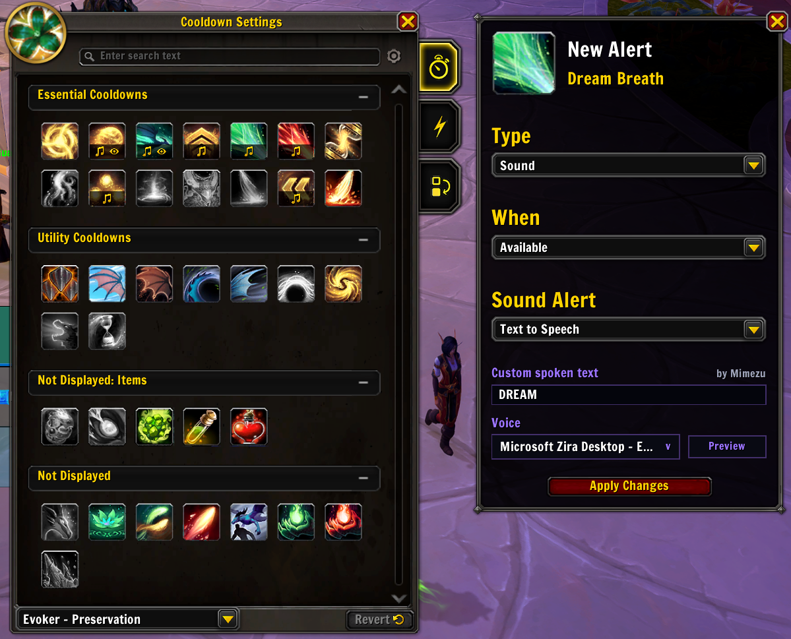

# CDM Custom TTS 0.4.0

## 0.4.0

- Added optional fixed TTS delays for Blizzard's On Aura Applied and On Aura Removed alerts.
- Reworked the TTS handoff so Blizzard's original full spell name is reliably suppressed before the custom phrase begins.
- Removed the persistent Cooldown Viewer taint caused by the older Apply-button integration.
- Added bounded repeat protection, simultaneous-alert batching, and timer cleanup on death or loading screens.
- Added automated install-ready ZIP publishing for milestone releases.

CDM Custom TTS is a World of Warcraft addon by **Mimezu** that extends the
native Cooldown Manager alert editor with short, custom text-to-speech phrases
and voice selection.

It stays inside Blizzard's existing alert workflow: select **Text to Speech** as
the sound alert, enter the phrase you want to hear, choose a voice, and apply the
alert normally.

*Custom spoken text and voice selection integrated directly into Blizzard's Cooldown Manager alert editor.*

## Features

- Custom spoken text for native Cooldown Manager spell alerts
- Installed system TTS voice selection
- In-editor voice preview
- Per-spell and per-alert-event phrases
- Optional fixed TTS delay for On Aura Applied and On Aura Removed alerts
- Combat-safe integration that does not replace Blizzard Cooldown Viewer code
- A repeat guard that prevents custom speech loops if an alert is emitted twice
- A bounded TTS handoff that reliably suppresses Blizzard's original full name
- Lightweight, standalone addon with no dependencies

## Installation

1. Download or clone this repository.
2. Place the `CDMCustomTTS` folder in:
   `World of Warcraft/_retail_/Interface/AddOns/`
3. Restart World of Warcraft or type `/reload` if the addon was already present.

## Usage

1. Open Blizzard's Cooldown Manager settings.
2. Add or edit a spell alert.
3. Set the alert type to **Sound**.
4. Select **Text to Speech** under **Sound Alert**.
5. Enter your custom spoken text and choose a voice.
6. For an aura alert, optionally enter a **Delay TTS** value in seconds.
7. Use **Preview**, then select **Apply Changes**.

The delay begins when Blizzard fires its native aura event. It is a fixed timer
and does not inspect protected aura duration data, so refreshes, extensions, or
early aura removal do not automatically change an already running timer.
A configured On Aura Removed TTS alert will cancel a pending delayed On Aura
Applied phrase for the same cooldown before handling its own phrase.

TTS volume is controlled by World of Warcraft's native text-to-speech settings.
Immediate replacements use a brief handoff of about 0.15 seconds so Blizzard's
queued full-name utterance is fully stopped before the custom phrase begins.

After updating from version 0.2.2 or earlier, use `/reload` before entering
combat. Reloading discards any Cooldown Viewer tables tainted by the older Apply
button integration.

## Compatibility

CDM Custom TTS targets current Retail World of Warcraft and Blizzard's native
Cooldown Manager. It is not intended for Classic clients.
